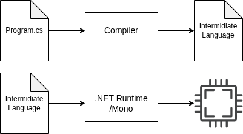
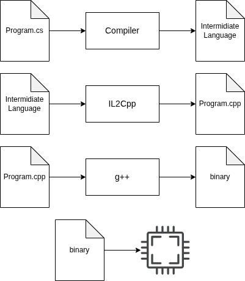

Mod development
===================================

Developing new mods for Blasphemous and Blasphemous II differs a little, but the
principle is the same and the tools are very similar.

.. danger::
   Some tools talked about here allows you to read parts of the (transformed)
   source code of some games and programs.
   The source code of most games are protected with a license or copyrights.
   That does not mean you are not allowed to use these tools and explore the
   code by yourself, but do not under any circumstance share the original source
   code of a program/game for which you don't own the rights to do so.

What is modding?
----------------

In simple terms, modding is writing code that will be injected into the
executable of a program to alter the way it work. It's mainly used for video
games to add new content or change the rules of the game.

How does that work?
-------------------

The executable of the game contains all of the instructions to run the game.
Using tools like `BepInEx`_ or `Melon Loader`_, it is possible to insert your
own instructions in the middle of the game's isntructions.

.. _BepInEx: https://github.com/BepInEx/BepInEx
.. _Melon Loader: https://github.com/LavaGang/MelonLoader

In particular, what we look for is to **patch functions**.
Functions are common block of instructions executed together, that may produce a
result. They are created by the developers of the game to not have redundant
code.

Image a function ``MovePlayerLeft(int pixels)``. It is called ``MovePlayerLeft`` and
takes an integer ``pixels`` in input. It is self explanatory, it will move the
player to the left by the amount of pixels you have indicated it.
Now imagine that this functions is called everytime you press the left arrow key
in game, and you want the player to receive money everytime they move left.
What you want to do is to **patch** this function.

Patching allows you to chose whether the code you want to insert will be
executed *before*, *after* or *replace* the code of the function you have
selected.
In this example it doesn't matter if the money is given before or after the
player moves left, but we do want to keep the player moving left so we won't
whose to replace the function with our patch.

All there is left to do is to write the code that will give the player money (we
can even chose the amount depending on the amount of pixels the player will
move), and give the indications of which function we want to patch and how we
want to patch it.

That is basically all modding is on the *writing* part.

.. _Blasphemous Randomizer Wiki: https://brandenek.github.io/Blasphemous.Randomizer.Wiki/

How to you know which function to patch? That's a good question.
First, let's explain how Unity games are compiled.

How are Unity games compiled?
-----------------------------

Games in Unity are usually coded in a programming language called C#. What
matters is that C# is a language that is compiled into a bytecode called
"Intermidiate Language" (abbreviated "IL"). This IL cannot be run by your
computer directly and must run on what's called a runtime. It will translate the
IL into instructions for you platform and processor.

   Compiling a C# source file into IL, then running it through the .NET Runtime.

So in theory, the same C# code compiled into IL can be executed on any machine
and give the same result. It also has a huge advantage for modding, because
bytecode is easier to decompile than machine code, and this is very useful to
find functions to patch or understand how the game works internally. It also
keeps a lot of symbols and metadata intact, which is very important to be able
to read the decompiled code.

This is what Blasphemous 1 used, this is the basic approach. For Blasphemous 2
on the other hand, the game has been compiled using `Il2Cpp`_, which then
compiles the IL into C++ source code, which is then compiled directly into
machine code.

.. _Il2Cpp: https://docs.unity3d.com/2022.3/Documentation/Manual/IL2CPP.html

This has a few benefits for the developers, but this makes modding even more
difficult, because during all of those steps, a lot of metadata and symbols are
lost, it is practically impossible to decompile the generated assembly back into
C# source code, and parts of the runtime are mixed with the game's code in the
final assembly.

   Compiling a C# source file into a C++ source file using Il2Cpp, then into an
   executable file using g++, and running it directly on the processor.

This is the approach that Blasphemous 2 uses. Because of the big differences
between those two ways of compiling a game, the tools to load and make mods are
not the same.

For games compiled with the .NET Framework into IL, which is then ran by a
runtime, `BepInEx`_ is used to inject the patches into the game and load the
mods, while tools like `dnSpy`_ are used to decompile the game into C# code.

.. _dnSpy: https://github.com/dnSpy/dnSpy

For games compiled with Il2Cpp into executables, `Melon Loader`_ is used to
inject the patches into the game and load the mods, while tools like `ghidra`_
are used to decompile the game into C++ code.

